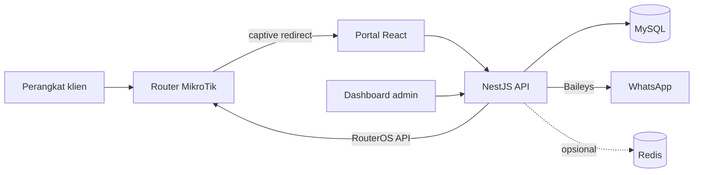

# Hotspot Gateway

Sistem manajemen hotspot MikroTik: portal captive, voucher, iklan, dan pengiriman kode akses lewat WhatsApp.

Backend NestJS + Prisma + MySQL. Frontend React (Vite) + Tailwind. Gateway WhatsApp memakai [Baileys](https://github.com/WhiskeySockets/Baileys) secara in-process — tanpa layanan WAHA terpisah.

## Fitur

- **Portal captive** — alur video iklan → formulir → permintaan voucher
- **Voucher** — profil, batch, masa berlaku, kuota, dan sinkronisasi user hotspot MikroTik
- **WhatsApp** — multi-sesi, QR pairing, round-robin pengirim, variasi template, log pesan
- **Admin** — dashboard, user online, router, iklan, log sistem, pengaturan
- **Monitoring** — sesi hotspot real-time lewat WebSocket (opsional Redis untuk multi-instance)
- **Keamanan** — JWT + refresh token, role-based access, enkripsi kredensial router, rate limit

## Arsitektur



| Lapisan | Teknologi |
| --- | --- |
| Frontend | React 18, Vite, Tailwind, shadcn/ui, Socket.IO client |
| Backend | NestJS 11, Prisma 6, Passport JWT, Socket.IO |
| Data | MySQL / MariaDB, Redis opsional |
| Integrasi | MikroTik RouterOS API, WhatsApp via Baileys |

## Prasyarat

- [Bun](https://bun.sh) (disarankan) atau Node.js 22+
- MySQL 8 / MariaDB
- Router MikroTik dengan API (`8728`) diaktifkan
- Redis (opsional)

Runtime backend memakai **Bun** agar alias path `@/` ter-resolve setelah `nest build`.

## Mulai cepat

```bash
git clone https://github.com/KirisakiRei/hotspot-gateway.git
cd hotspot-gateway
```

### 1. Database

Buat database kosong, lalu salin environment:

```bash
cd backend
cp .env.example .env
```

Isi `DATABASE_URL`, `JWT_SECRET`, `JWT_REFRESH_SECRET`, dan `ENCRYPTION_KEY` (masing-masing minimal 16 karakter acak).

```bash
bun install
bunx prisma migrate deploy
bunx prisma generate
bun run prisma:seed
bunx nest build
bun dist/src/main.js
```

API tersedia di `http://localhost:3001/api`.

### 2. Frontend

```bash
cd frontend
cp .env.example .env
bun install
bun run dev
```

Portal: `http://localhost:5173`  
Admin: `http://localhost:5173/admin`

### Akun seed (hanya development)

| Peran | Email | Password |
| --- | --- | --- |
| Super Admin | `admin@hotspot.local` | `admin123` |
| Admin | `operator@hotspot.local` | `operator123` |
| Operator | `viewer@hotspot.local` | `viewer123` |

Ganti semua password ini sebelum dipakai di lingkungan nyata.

## WhatsApp

1. Buka **Admin → Settings → WhatsApp**
2. Tambah sesi (nomor pengirim, format internasional tanpa `+`)
3. Scan QR dari perangkat WhatsApp
4. Atur threshold round-robin (default 5 pesan per nomor)

Kredensial sesi Baileys tersimpan di `backend/wa-auth/` (sudah di-ignore Git). Jangan membagikan folder itu.

## MikroTik

Kredensial router disimpan terenkripsi di database (`ENCRYPTION_KEY`). Contoh skrip walled-garden dan halaman login ada di:

- `hotspot-setup.rsc`
- `mikrotik-pages/`
- `login.html`

Pastikan hostname portal (`wifi.rekavia.com`) dan WhatsApp masuk walled-garden. Video iklan diputar dari VPS — jangan buka YouTube di walled garden.

## Produksi (VPS)

Panduan lengkap (Nginx, systemd, WireGuard, MikroTik, SSL):

- [`deploy/README.md`](deploy/README.md)

Ringkas:

1. DNS `wifi.rekavia.com` → IP VPS
2. Build backend (`bun dist/src/main.js`) + frontend (`VITE_API_URL=https://wifi.rekavia.com/api`)
3. Nginx satu origin: `/` SPA, `/api` + `/videos` + `/socket.io` ke Nest
4. WireGuard VPS `10.8.0.1` ↔ MikroTik `10.8.0.2`; API `8728` hanya dari tunnel
5. Upload `login.html` ke folder hotspot router

## Struktur repositori

```
backend/                 NestJS API
  prisma/               Schema, migrasi, seed
  src/modules/          auth, voucher, mikrotik, whatsapp, …
frontend/               Portal + dashboard admin
mikrotik-pages/         Halaman login/status hotspot
```

## Keamanan

- File `.env` tidak boleh di-commit. Gunakan `.env.example` sebagai acuan.
- Secret JWT dan kunci enkripsi wajib diisi; aplikasi gagal start jika kosong atau terlalu pendek.
- Folder `wa-auth/` berisi sesi WhatsApp — perlakukan seperti password.
- Password seed hanya untuk pengembangan lokal.

## Lisensi

Proyek ini bersifat privat (`UNLICENSED`). Hak cipta tetap pada pemilik repositori.
